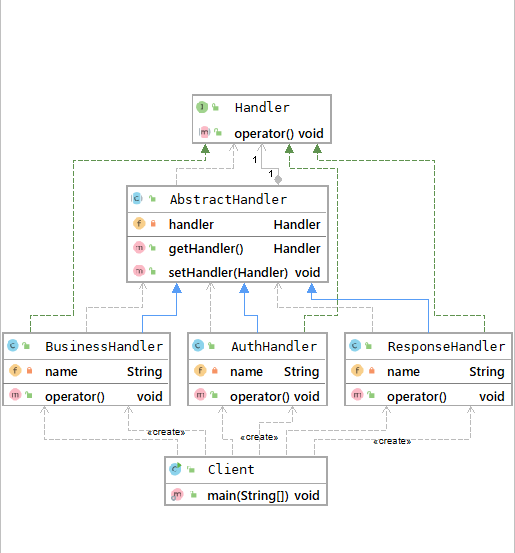

## 责任链模式
### 概述
责任链（Chain Of Responsibility) 模式又称作职责链模式，
用于避免请求发送者与多个请求处理者耦合在一起。让所有请求的处理者
持有下一个对象的引用，从而将请求串联成一条链，有请求发生时，可将请求沿着这条链传递，
直到遇到该对象的处理器

在责任链的模式下，用户只需将请求发送到责任链上即可，无需关心请求的处理细节和传递
过程，所以责任链模式优雅地将请求的发送和处理进行了解耦。

责任链模式在Web请求中很常见，比如我们要为客户提供一个Rest服务，服务端
要针对客户端的请求实现用户鉴权、业务调用、结果反馈流程，就可以使用责任链模式
实现。

### 主要角色
- Handler接口
用于规定在责任链上具体要执行的方法。
- AbstractHandler抽象类
迟疑Handler实例并通过setHandler()和getHandler()将
各个具体业务Handler串联成一个责任链，客户端上的请求在责任链上执行

- 业务Handler
用户根据具体业务需求实现的业务逻辑

