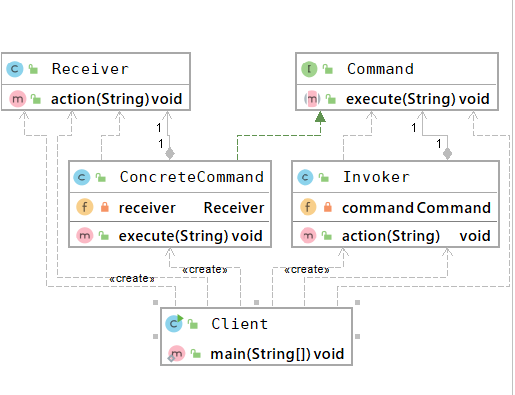

## 命令模式
### 概述
命令模式(Command Pattern) 模式将请求封装为命令基于时间驱动异步地执行，
以实现命令发送者和命令执行者之间的解耦，提高命令发送、执行的效率和灵活度。

命令模式将命令调用者和命令执行者解耦，有效的降低系统的耦合度。同时，由于命令调用者和
命令还醒着进行了解耦，所以增加和删除（回滚）命令变得非常简单

### 主要角色
- 抽象命令类（Command）
执行命令的接口，定义执行命令的抽象方法execute()。

- 具体命令类（Concrete Command）
抽象命令类的实现类，持有接收者对象，并在接收到命令之后调用
执行者的方法action()实现命令调用和执行。

- 命令执行者（receiver)
命令具体的执行者，定义了命令执行的具体方法action()

- 命令调用者(Invoker):
接收客户端的命令并异步执行

     