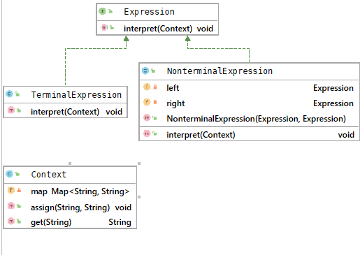

## 解释器模式
### 概述
解释器模式（Interpreter Pattern）给定一种语言并定义该语言的语法表示，然后
设计一种解释器来解释语言中的语法，这种模式常用SQL解析、符号处理引擎等。

### 主要角色
- 抽象表达类（Abstract Expression）
定义解释器的接口，约定解释器所包含的操作，比如interpret()方法

- 终结符表达式（Terminal Expression）
抽象表达式子类，用于定义语法中和终结符相关的操作，语法中的每一个终结符
都有一个与之对应的终结表达式。

- 非终结符表达式（Nonterminal Expression)
抽象表达式的子类，用于定义语法中和非终结符有关的操作，语法中的每条规则都有一个
非终结符表达式与之对应。

- 环境(Context）
定义各个解释器需要的共享数据或者公共功能。

