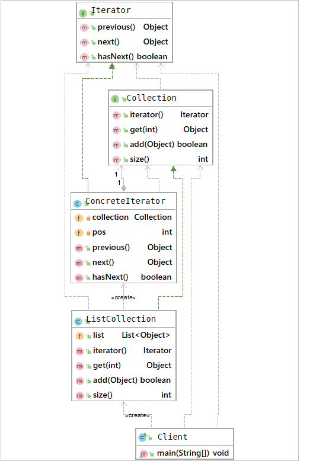

## 迭代器模式
### 概述
迭代器（Iterator)模式提供而顺序访问集合对象中的各种元素，而不暴露对象内部结构的方法

Java中的集合就是典型的迭代器模式，比如HashMap，在我们需要遍历HashMap时，
通过迭代器不同地获取next元素就可以遍历集合中所有的元素。

迭代器模式将遍历集合所有元素的操作封装成迭代器类，其目的是在不暴露
集合对象内部结构的情况下，对外提供统一访问内部数据的方法。迭代器的实现一般
包括一个迭代器，用于执行具体的遍历操作；以及一个Collection，用于存储具体的数据。

