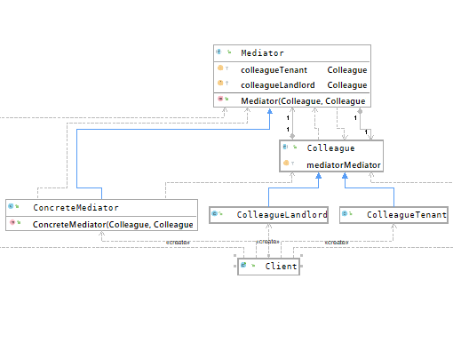

## 中介者模式
### 概述
中介者模式（Mediator Pattern）指对象和对象之间不直接交互，而是通过一个
名为中介者角色来实现对象之间的交互，使原有的对象之间的关系变得松散，且可以
通过定义不同的中介者来改变他们之间的交互。中介者模式又叫作调停模式，是迪米特
法则的典型应用
>迪米特法则：一个软件实体对于其他实体的引用越少越好，
或者说这两个类不必彼此直接通信，那么这两个类就不应当发生直接通信的相互作用，
而是通过引入一个第三者简介交互。

中介者模式属于对象行为型模式，其主要特点是将对象与对象之间的关系变为对象和中介者
之间的关系，降低了对象之间的耦合性，提高了对象功能的复用和系统的灵活性。

### 主要角色
- 抽象中介者（Mediator）
中介者接口，定义了注册同事对象方法和转发对象信息的方法。

- 具体中介者（Concrete Mediator）
中介者接口的实现类，定义了一个List来保存同事对象，协调多个同事角色之间的交互关系。

- 抽象同事类（Colleague)
定义同事类接口，持有中介者对象，并定义同事对象交互的抽象方法，同时实现同事类
的公共方法和功能。

- 具体同事类（Concrete Colleague）
抽象同事类的实现者，在需要与其他同事对象交互时，通过中介者对象来完成。

>以租房场景为例，在租房的时候会找房屋中介，把自己的租房需求告诉中介，中介再
把需求告知房东，在整个过程中，租房者和房东不产生直接关系（也不能产生直接关系，
否则中介就没钱赚了），而是通过中介来完成信息的交互，这样就完成了对象之间的相互解耦

