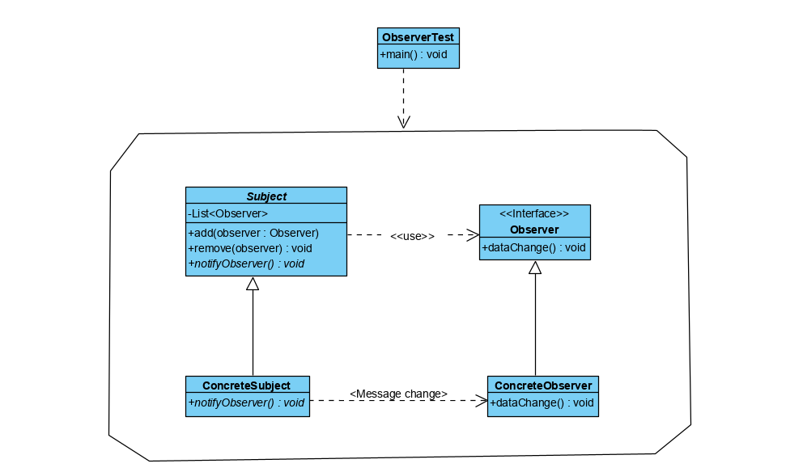

## 观察者模式
### 概述
观察者模式（Observer Pattern）指在被观察者的状态发生变化的时，系统基于时间驱动理论
将其状态通知到订阅其状态的观察者对象中，已完成状态的修改和事件的传播。这种模式
又叫做发布-订阅模式或者模型-视图模式。

### 主要角色
观察者模式是一种行为模式，观察者和被观察者之间的关系属于抽象耦合关系，主要优点
是指奶观察者和被观察者之间建立了一套时间触发机制，以降低二者的耦合度

- 抽象主题（Subject）
持有订阅了该主题的观察者对象集合，同时提供了增加、删除观察者对象的方法和主题
发生变化后的通知方法。
- 具体主题（Concrete Subject）
实现了抽象主题的通知方法，在主题内部状态发生变化时，调用该方法通知订阅了主题
状态的订阅者对象。
- 抽象观察者（Observer）
观察者的抽象类或者接口，定义了主题状态发生了变化是需要调用的方法
- 具体观察者（Concrete Observer）
抽象观察者的实现类，在收到主体状态发生变化的信息后调用具体的触发机制。

