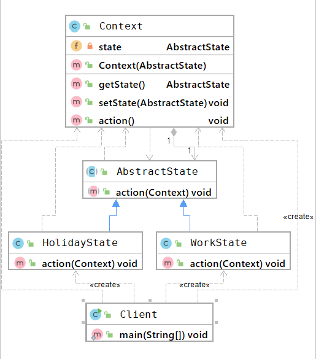

## 状态模式
### 概述
状态模式值=指给对象定义不同的状态，并为不同的状态定义不同的行为，
在对象的状态发生变化的时，自动切换状态的行为。

状态模式是一种对象行为型模式，它将对象不同行为封装到不同的状态中，遵循
了“单一职责”原则。同时，状态模式基于对象的状态将对象行为进行了明确的界定，减少了
对象行为之间的相互依赖，方便系统的扩展和维护。

状态模式在生活中很常见，比武日常生活中有工作状态、休假状态。

### 主要角色
状态模式把受环境改变的对象行为包装在不同的状态对象中，用于让一个对象
在其内部状态改变时，行为也随之改变。

- 环境（Context）
也叫做上下文，用于维护对象当前的状态，并在对象状态发生变化时
触发对象行为的变化。

- 抽象状态（AbstractState）
定义了一个接口，用于定义对象中不同状态所对应的行为。

- 具体状态（Concrete State）
实现抽象状态所定义的行为。

