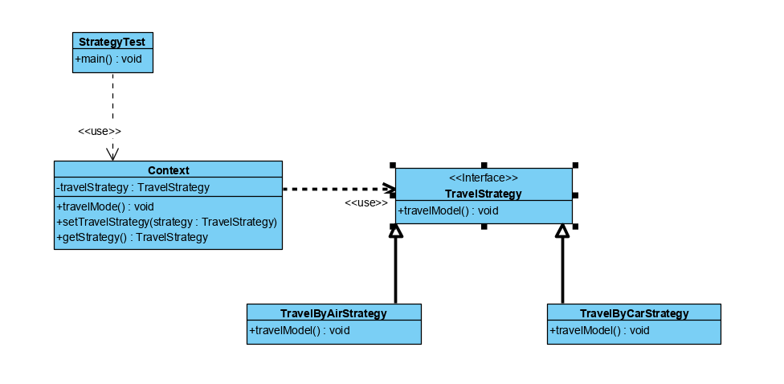

## 策略模式
### 概述
策略模式（Strategy Pattern）为同一个行为定义了不同的策略，并为
每种策略都实现了不同的方法。在用户使用的时候，系统根据不同的策略自动切换
不同的方法来实现策略的改变。同一个策略下的不同方法是对同一个功能的不同实现
，因此在使用时可以相互替换而不影响用户的使用。

策略模式的实现是在接口中定义不同的策略，在实现类中完成不同策略下具体行为的实
现，并将用户的策略状态存储在上下文（Context）中完成策略的存储和状态的改变。

>在显示生活中常常碰到实现目标有多重可选策略的情况，比如在下班之后有多种
交通方式回家

针对于上述的情况，使用多重if else条件转移也可以实现，但是书序硬编码，这样做
不但会使代码变得复杂，难懂，而且违背了开闭原则。

>策略模式类似于平常写的Service