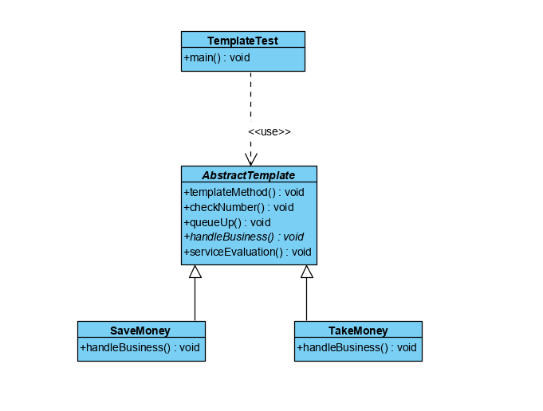

## 模板方法
### 概述
模板方法（Template Pattern）模板定义了一个算法框架，并通过继承方法将
算法的实现延迟到子类中，使得子类可以在不改变算法框架及其流程的前提下
、重新定义该算法在某些特定环节的实现

该模式在抽象类中定义了算法的结构并实现了部分公共算法，在子类中实现可变的
部分并根据不同的业务需求实现不同的扩展。
模板方法的优点在于其父类中实现了算法的公共部分的方法来保障代码的复用：将部分算法
延迟到子类来实现，符合开闭原则。

### 主要角色
模板方法模式需要注意抽象类和具体子类之间的写作，在具体使用时包含以下主要角色
- 抽象类：定义了算法的框架，由基本方法和模板方法组成。基本方法定义了算法的环节，
模板方法定义了算法各个环节的实现流程。

- 具体类：对抽象类中定义的算法根据需求进行不同的实现

>以银行办理业务为例实现一个模板方法模式，我们去银行都要经过抽号，排队，
办理业务和评价，其中业务流程是固定的，但办理业务的具体业务较多，比如取钱、
存钱、开卡邓。其中，办理业务的固定流程就是模板方法中的框架，它常常是不变的，
由抽象定义和实现，而具体的业务是不变的部分，通常交给子类去实现。
