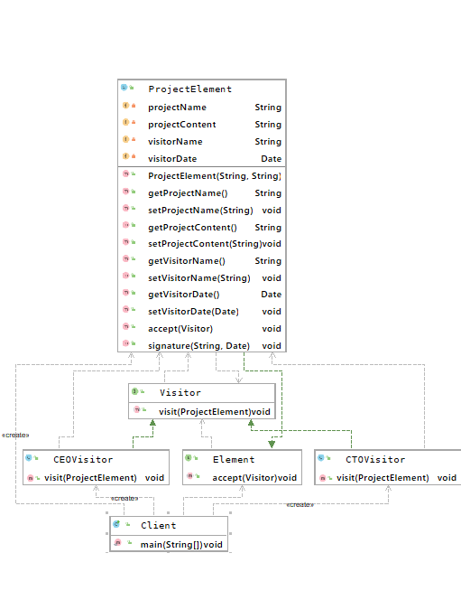

## 访问者模式
### 概述
访问者（Visitor）模式将数据结构和对数据的操作分离开来，使其不改变数据结构
的前提下动态添加作用于这些元素上的操作。它将数据结构的定义和数据操作的定义
分离开来符合“单一职责”原则。访问者模式通过定义不同的访问者实现对数据不同的
操作，因此需要给数据添加新的操作时，只需要为其定义一个新的访问者即可。

访问者模式是一种对象行为模式，主要特点是将数据结构和作用于数据结构上的操作
就，使得集合的操作可自由地演化而不影响其数据结构。它适用于数据结构稳定但是
数据操作方式多变的系统

### 主要角色

- 抽象访问者（Visitor） 
定义一个访问元素的接口，为每类接口都定义了一个访问操作visit()，该操作中的参数
类型对应被访问元素的数据类型。

- 具体访问者（Concrete Visitor）
抽象访问者的实现类，实现不同访问者访问到元素后具体的操作行为

- 抽象元素（Element）
元素的抽象表示，定义了访问该元素的入口accept()方法，不同的访问者类型
代表了不同的访问者。

- 具体元素（Concrete Element）
实现抽象元素定义的accept（）操作，并根据访问者的不同类型实现不同的业务逻辑

