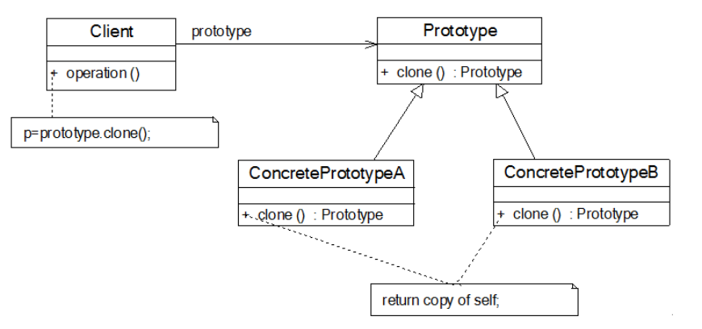

## 原型模式
### 原型模式的概念
原型模式是指通过调用原型实例的Clone方法或者其他手段来创建对象

原型模式属于创建型设计模式，以当前对象为原型（蓝本）来创建另一个新的对象，而无需知道创建的细节。
原型模式在Java中通常使用Clone技术实现，在JavaScript中通常使用对象的原型属性实现。

原型模式的Java实现很简单，秩序原型类实现Cloneable接口，并且重写clone方法即可

### Java复制的分类
- 浅克隆
Java中的浅复制是通过**实现Cloneable接口并覆盖clone方法实现的**，
在浅复制过程始终，<u>对象的基本数据类型的变量值会重新被复制和创建,
而引用数据类型仍指向原对象的应用</u>，也就是说浅复制不会复制对象的
引用数据类型。
- 深克隆
在复制过程中，不论是<u>基本数据类型还是引用数据类型，都会被重新复制和创建
。</u>简而言之，深复制彻底的复制了对象的数据（包括引用类型和基本数据类型），
浅复制并不彻底（忽略了引用类型）。

>深克隆的实现方式在实质上就是同时克隆应用对象直到引用对象的属性全部为基本类型

### 小结
1.主要优点

原型模式的主要优点如下：

(1) 当创建新的对象实例较为复杂时，使用原型模式可以简化对象的创建过程，通过复制一个已有实例可以提高新实例的创建效率。

(2) 扩展性较好，由于在原型模式中提供了抽象原型类，在客户端可以针对抽象原型类进行编程，而将具体原型类写在配置文件中，增加或减少产品类对原有系统都没有任何影响。

(3) 原型模式提供了简化的创建结构，工厂方法模式常常需要有一个与产品类等级结构相同的工厂等级结构，而原型模式就不需要这样，原型模式中产品的复制是通过封装在原型类中的克隆方法实现的，无须专门的工厂类来创建产品。

(4) 可以使用深克隆的方式保存对象的状态，使用原型模式将对象复制一份并将其状态保存起来，以便在需要的时候使用（如恢复到某一历史状态），可辅助实现撤销操作。

2.主要缺点

原型模式的主要缺点如下：

(1) 需要为每一个类配备一个克隆方法，而且该克隆方法位于一个类的内部，当对已有的类进行改造时，需要修改源代码，违背了“开闭原则”。

(2) <u>在实现深克隆时需要编写较为复杂的代码，而且当对象之间存在多重的嵌套引用时，为了实现深克隆，每一层对象对应的类都必须支持深克隆，实现起来可能会比较麻烦</u>。

3.适用场景

在以下情况下可以考虑使用原型模式：

(1) 创建新对象成本较大（如初始化需要占用较长的时间，占用太多的CPU资源或网络资源），新的对象可以通过原型模式对已有对象进行复制来获得，如果是相似对象，则可以对其成员变量稍作修改。

(2) 如果系统要保存对象的状态，而对象的状态变化很小，或者对象本身占用内存较少时，可以使用原型模式配合备忘录模式来实现。

(3) 需要避免使用分层次的工厂类来创建分层次的对象，并且类的实例对象只有一个或很少的几个组合状态，通过复制原型对象得到新实例可能比使用构造函数创建一个新实例更加方便。 
