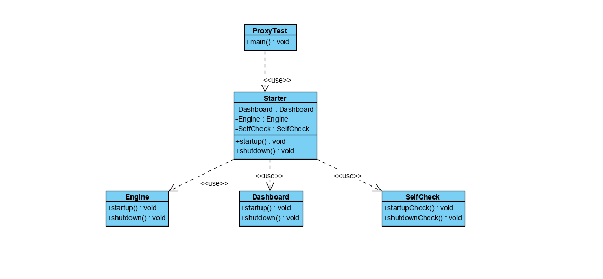

## 外观模式
外观模式（Facade Pattern），也叫做门面模式，通过一个门面（Facade）向客户端提供
一个访问系统的统一接口，客户端无需关心和知晓系统内部各个子模块之间的复杂关系，其主要目的是降低访问
拥有多个子系统的复杂系统的难度，简化客户端的难度，简化客户端与其之间的接口。

## 主要角色

- 子系统角色：实现了子系统的功能
- 门面角色：外观模式的核心，熟悉各个子系统的功能和调用关系
并根据客户端的需求封装统一的方法来对外提供服务。
- 客户角色：通过Facade来完成业务

>以汽车的启动为例，用户只需要按下启动按钮，后台就会自动完成引擎的启动、仪表盘启动、
车辆自检等过程。通过外观模式将汽车启动这一系列就成封装到启动按钮上，对用户来说只需按下启动按钮即可，
不用关心具体的细节 