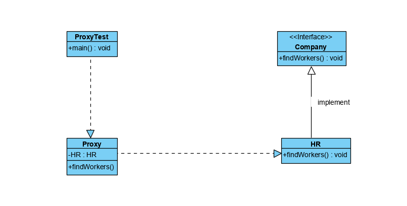

## 代理模式
### 概述
代理模式指为对象提供一种通过代理的方式来访问并控制该对象行为的方法。
在客户端不适合或者不能够直接引用一个对象的时候，可以对该对象的代理对象来实现
对该对象的访问，可以将**该代理对象理解为客户端和目标对象之间的中介者**。

>代理模式和装饰者模式和类似，主要的区别在于接口的另一个实现类中的方法实现不同,
装饰者模式是对原来方法的进一步补充，而代理模式则是真正操作的存在9补充

### 主要角色
- 代理 
- 被代理者

>在被代理者需要做一项工作的时候，不用自己做，而是交给代理做

