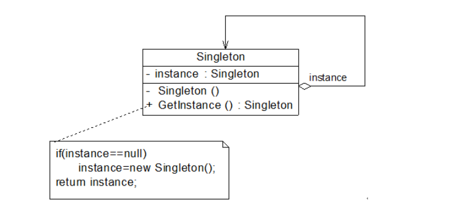

## 单例模式
在某些情况下系统要保证某个类只有唯一实例，单例模式是保证系统实例唯一性的
重要手段。单例模式首先通过将类的**实例化方法（构造方法）私有化**来防止通过其他方式创建该
类实例，然后通过**提供一个全局唯一获取该类实例的方法**来帮助用户获取该实例

## 如何实现单例模式
- 懒汉模式 
- 饿汉模式

- 饿汉模式相对来说会造成资源的浪费,不能实现延迟加载，不管将来用不用始终占据内存；
- 懒汉模式存在线程安全问题，解决方案，在getInstance加锁（但是直接加synchronized，会导致很大的性能开销）
相对来说，加锁其实只需要在第一次初始化的时候用到，之后的调用都没必要进行加锁的操作

对于饿汉模式模式而言，可以直接初始化在类中直接初始化变量，也可以通过静态代码块进行初始化操作
使用饿汉模式，还可以通过枚举来实现饿汉模式
JVM会保证枚举的实例化方法只被执行一次

## 小结
1.主要优点

单例模式的主要优点如下：

(1)单例模式提供了对唯一实例的受控访问。因为单例类封装了它的唯一实例，所以它可以严格控制客户怎样以及何时访问它。

(2)由于在系统内存中只存在一个对象，因此可以节约系统资源，对于一些需要频繁创建和销毁的对象单例模式无疑可以提高系统的性能。

(3)允许可变数目的实例。基于单例模式我们可以进行扩展，使用与单例控制相似的方法来获得指定个数的对象实例，既节省系统资源，又解决了单例单例对象共享过多有损性能的问题。

2.主要缺点

单例模式的主要缺点如下：

(1)由于单例模式中没有抽象层，因此单例类的扩展有很大的困难。

(2)单例类的职责过重，在一定程度上违背了“单一职责原则”。因为单例类既充当了工厂角色，提供了工厂方法，同时又充当了产品角色，包含一些业务方法，将产品的创建和产品的本身的功能融合到一起。

(3)现在很多面向对象语言(如Java、C#)的运行环境都提供了自动垃圾回收的技术，因此，如果实例化的共享对象长时间不被利用，系统会认为它是垃圾，会自动销毁并回收资源，下次利用时又将重新实例化，这将导致共享的单例对象状态的丢失。

3.适用场景

在以下情况下可以考虑使用单例模式：

(1)系统只需要一个实例对象，如系统要求提供一个唯一的序列号生成器或资源管理器，或者需要考虑资源消耗太大而只允许创建一个对象。

(2)客户调用类的单个实例只允许使用一个公共访问点，除了该公共访问点，不能通过其他途径访问该实例。