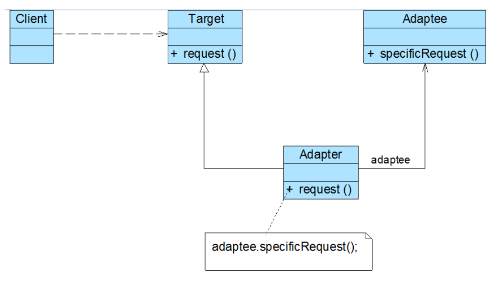

## 适配器模式
### 概述
我们常常在开发中遇到各个系统之间的对接问题，然而每个系统的数据局模型或多或少均存在差别，因此存在修改现有对象模型的情况，这将影响
到系统的稳定。如想要在不修改原有代码结构（类的结构）的情况下完成友好对接，就需要使用到适配器模式。

适配器模式（Adapter Pattern）通过定义一个适配器类所谓两个不兼容的接口之间的桥梁，
将一个类的接口转换用户期望的另一个接口，是的两个或多个原本不兼容的接口可以基于适配器类
一起工作。

### 适配器模式的分类
- 类适配器模式
在不需要改变（或者由于项目原因无法改变）原有接口和类结构的情况下扩展类的功能
以适配不同的接口时，可以使用类的适配器模式。适配器模式通过创建一个原有类（需要扩展的类）
并实现新的接口的适配器类来实现。
- 对象适配器
对象适配器的思路和类适配器的思路模式基本相同，只是修改了Adapter类。Adapter我不在继承Source类，而是锤友Source类的实例，
以解决兼容问题。

- 接口适配器
在不希望实现一个接口中的所有方法的时候，可以创建一个抽象类AbstractAdapter实现所有方法，在使用时
继承该抽象类按需实现方法即可。

### 主要角色

● Target（目标抽象类）： 目标抽象类定义客户所需接口，可以是一个抽象类或接口，也可以是具体类。

● Adapter（适配器类）： 适配器可以调用另一个接口，作为一个转换器，对Adaptee和Target进行适配，适配器类是适配器模式的核心，在对象适配器中，它通过继承Target并关联一个Adaptee对象使二者产生联系。

●Adaptee****（适配者类）： 适配者即被适配的角色，它定义了一个已经存在的接口，这个接口需要适配，适配者类一般是一个具体类，包含了客户希望使用的业务方法，在某些情况下可能没有适配者类的源代码。

### 小结
