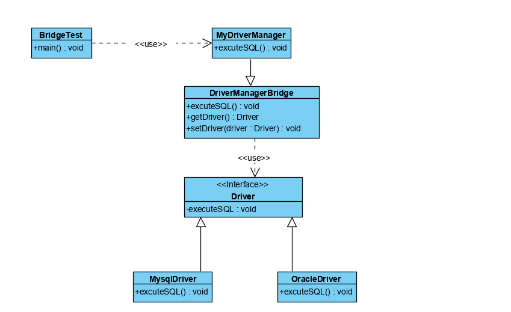

## 桥接模式
### 概述
桥接模式（Bridge Pattern）通过将抽象及其实现解耦，使二者可以根据
也无需求独立变化。这种命类型的设计属于结构型模式，通过定义一个抽象
和实现之间的桥接着来达到解耦的目的。

桥接模型主要用户解决需求多变的情况下使用类继承造成类爆炸的情况，扩展起来不够灵活
。可以通过桥接模型将抽象部分与实现部分分离，使其能够独立变化而相互之间的功能
不受影响。具体的做法是通过定义一个桥接接口，使得实体类的功能独立于接口之上。

>我们常用的JDBC和DriverManager就是用桥接模式，JDBC在连接数据库时，在各个数据库之间
进行切换而不需要修改代码，因为JDBC提供了统一的接口，每个数据库都提供了各自的接口实现，
通过一个叫做数据库驱动的程序进行桥接即可。

