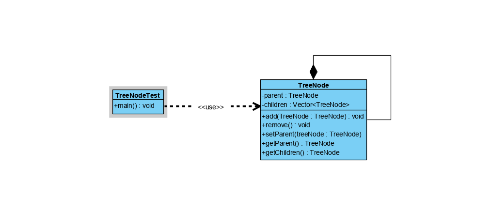

## 组合模式
### 概述
组合模式（Composite Pattern）又叫做部分整体模式，主要用户实现部分和整体操作
的一致性。组合模式常根据树形结构表示部分及整体之间的噶云溪，使得用户对单个对象和组合
对象的操作具有一致性。

组合模式通过特定的数据结构简化了部分和整体之间的关系，是的客户端可以像处理单个元素一样来处理整体的
数据集，而无需关心单个元素和整体数据集之间的内部复杂数据结构

**组合模式以类似树形结构的方式实现整体和部分之间的关系的组合**
